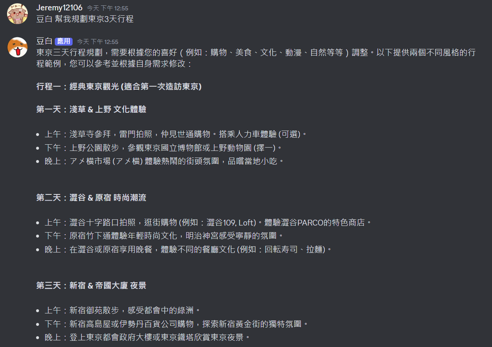
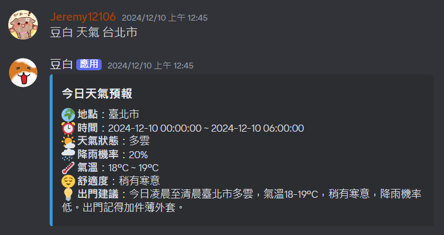
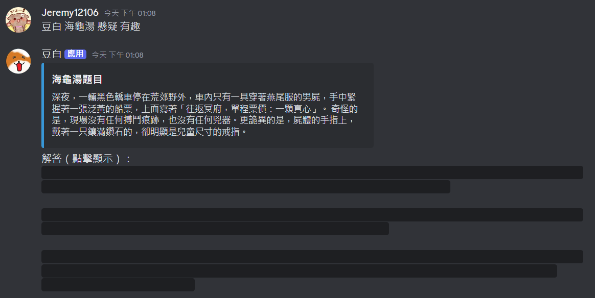

# Discord Bot

豆白，一個功能強大、簡單易用的 Discord 機器人，提供多種功能來增加你的伺服器體驗！


## 🚀 功能

🎵 音樂播放：支援播放 YouTube 音樂，讓語音更加歡樂。  
🤖 語言模型：整合語言模型，機器人對話更靈活生動。  
🌤️ 氣象預報：即時提供天氣資訊，給予出門建議。  
🍜 拉麵推薦：精選台北捷運沿線的美味拉麵推薦。  
🖼️ 梗圖搜尋：建立並管理專屬的梗圖庫，隨時分享圖片。  
🎮 特色小遊戲：內建終極密碼與海龜湯等小遊戲，增添互動樂趣。  


## 🛠️ 安裝與執行

### 使用 Docker

1. 確保已安裝 [Docker](https://www.docker.com)。
2. 複製專案：
    ```
    git clone https://github.com/Jeremy12106/discord-bot.git
    cd discord-bot
    ```
3. 建立並啟動容器：
    ```
    docker build -t discord_bot .
    docker compose up
    ```

### 手動執行

1. 安裝 Python 依賴：
    ```
    pip install -r requirements.txt
    ```
2. 啟動機器人：
    ```
    python discord_bot.py
    ```


## 🔧 設定

1. 在根目錄中創建 `.env` 設定你的 bot token 和其他必要參數：
    ```
    // discord bot token
    DISCORD_TOKEN = ""

    // google gemini api key
    GOOGLE_API_KEY = ""

    // openai api key
    OPENAI_API_KEY = ""

    // 中央氣象署-資料開放平台 key
    WEATHER_API_KEY = ""

    // 日誌紀錄等級
    LOG_LEVEL = INFO
    ```
2. 在 `config` 檔案路經中分別設定 `bot_config.json` 和 `music_config.json`
    - `bot_config.json`
    ```
    {
    "prefix": "!",          // 機器人前綴
    "status": "online",     // 上線狀態：online, idle, dnd, invisible
    "activity": null,       // 活動狀態
    "personality": null,    // 機器人個性
    "gpt_api": "openai",    // 支援的語言模型API：gemini, openai
    "model": "gpt-4o-mini"  // 語言模型類型：gemini-1.5-flash, gpt-4o-mini
    }   
    ```
    - `music_config.json`
    ```
    {
    "display_progress_bar": false,                          // 顯示播放進度條
    "search_count": 10,                                     // 搜尋數量
    "before_options": "-analyzeduration 0 -probesize 32",   // FFMPEG設定，快速分析輸入檔案參數
    "options": "-ar 48000 -ac 2 -af 'anlmdn'"               // FFMPEG設定，設定音頻參數（採樣率、聲道數等）
    }
    ```


## 🖼️ 範例截圖

### 語言模型

- 使用 `@豆白 [訊息]` 來和豆白對話  
  

### 音樂播放

- 使用 `/play` 來播放音樂  
    - 支援搜尋功能  
          
    - 支援URL播放  
          

### 天氣預報

- 使用 `/weather [縣市]` 來查看即時天氣  
  

### 拉麵推薦

- 使用 `/ramen [捷運站]` 來找好吃拉麵  
  

### 圖庫搜尋

- 使用 `/mygo [台詞]` 來發一輩子的圖片  
  

### 特色遊戲

- 使用 `/soup [出題方向]` 來一場腦力激盪的海龜湯  
  


## 🤝 貢獻

歡迎提交問題與貢獻代碼！

1. Fork 本專案。
2. 創建分支 (`git checkout -b feature/您的功能名稱`)。
3. 提交更改 (`git commit -m '新增功能'`)。
4. Push 到分支 (`git push origin feature/您的功能名稱`)。
5. 提交 Pull Request。


## 📄 授權

此專案使用 [MIT License](https://opensource.org/license/mit)。歡迎自由使用和修改！